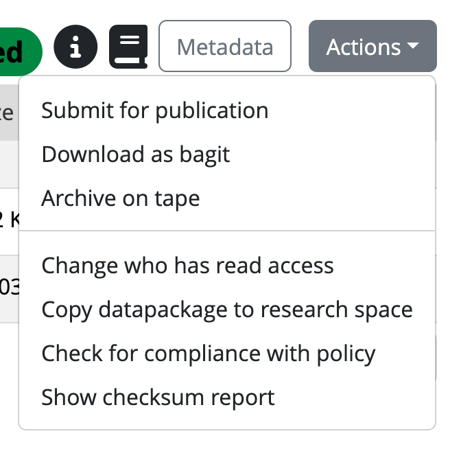
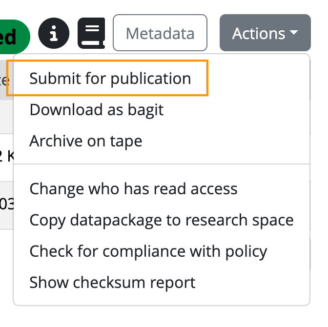

::: questions
-   How do you archive data from the Vault on SURF Data Archive (tape)?
-   How do you publish data using Yoda's publishing module?
:::

::: objectives
-   Demonstrate how to archive data in the Vault on SURF Data Archive
-   Demonstrate how to publish data in the Vault using Yoda
:::

::: instructor
Note that the Yoda instance that you are working on needs the connection to SURF Data Archive for the first part, and for the second part the publication module needs to be enabled.
:::

## Introduction

Once data is secured in the Vault, there are two useful additional steps that can be taken. The first is that **data in the Vault can be archived in the [SURF Data Archive](https://www.surf.nl/en/services/storage-data-management/data-archive){target="_blank"}**, where you store your data for a longer period of time. It is not a backup system, but intended for storing data you are not actively using. Note that not all Yoda instances are connected to the Data Archive, but in principal they could be. For training hosted by SURF, the Data Archive is connected to the SURF Yoda portal and you can archive data on tape.

The second option is to **publish the dataset on the web**. Your dataset will get a digital object identifier (DOI) assigned, and the metadata of the data package will be published in data catalogues. If the Access Type metadata field is set to 'Open - Freely retrievable', the data will be published as well and be available for download. In order to be readily available for download from the web, data must be on hot storage. So avoid the archiving of data that is published open access.

## Archive your data on tape

Now that you have a dataset secured in the Vault, it is quite likely that you do not need to work with the data for some time. In that case, it is a good idea to move the data to the SURF Data Archive, a tape-based storage system that is designed for secure, energy-efficient, long-term storage. Your data is still available to you if needed, and it is only accessible to the members of your Yoda group. But since the data will be stored offline on tapes, you will not be able to access the data directly anymore in the Vault. In case you need to work with the data again, you first need to unarchive it. Depending on the size of the dataset, this might take some time.

:::: challenge
## Submit your data to the archive

Only data secured in the Vault can be archived on tape. To archive your dataset in the Vault, you need to do the following:

-   Navigate to the `vault-` folder and click on your Vault submission. There you can find the Actions button again, and you click on Archive on tape:

{width="300"}

-   You will be asked to confirm that you agree to archive the datapackage to tape, because data will not be directly accessible after archiving. If you confirm, the archive action will be scheduled and some time later your dataset will be stored on tape.

::: solution
## Results

The scheduler will now schedule the archiving of your dataset. The tape robot will write it to tape and put it in the library. Watch it in action now:

{width="300"}
:::
::::

## Submitting the dataset for publication

Now that you have a dataset which includes both data and metadata in the Vault, you can also choose to publish this package. That is a great way to share your data with the world, allowing others to re-use it. In the Yoda metadata, you already provided information about the access conditions and license of the data. This is important to revisit before you actually publish the data. If you chose data to be open and freely retrievable under 'Data package access', the data will become publicly available after publication. In case you chose for restricted or closed access, only the metadata will be published. In case of open data, a suitable license should have been selected to make clear how the data can be re-used and attributed.

:::: challenge
## Submit your data for publication

Only data secured in the Vault, can be published on Yoda. To publish your dataset in the Vault, you need to do the following:

-   Navigate to the `vault-` folder and click on your Vault submission. There you can find the Actions button again, and you click on Submit for publication:

{width="300"}

-   You will be asked to confirm that you agree with the terms and conditions for publication.

-   If you confirm, the data manager will will receive a notification and will evaluate the data package on criteria like the structure and documentation, compliance with policies and regulations, and completeness of the metadata.

-   After this review, the data manager will either approve the publication, or ask you to make some additional changes to make the data package more FAIR. Once approved, your dataset will be published in Yoda (and the metadata in DataCite as well).

::: solution
## Results

When the data package has been published, the following will happen:

-   A public landing page will be created for the data package with all the Yoda metadata. The metadata will also be registered in [DataCite](https://commons.datacite.org/){target="_blank"}, which allows the data package to be easily findable for others on the internet.
-   A [Digital Object Identifier (DOI)](https://www.doi.org/){target="_blank"} will be assigned to the data package. You can use the DOI to cite the data package, for example in your manuscript, or to promote it via social media. You can find the DOI by clicking the “i” icon in the Yoda vault once the data package is published.

Here are some examples of datasets published on different Yoda publication platforms:

-   [Example open data package from WUR](https://doi.org/10.17887/WUR01-4RCCF3){target="_blank"}
-   [Example restricted data package from UU](https://doi.org/10.24416/UU01-3L9K99){target="_blank"}
-   [Example closed data package from VU](https://doi.org/10.48338/VU01-1LEDO2){target="_blank"}

:::
::::

::: keypoints
-   From the Vault, you can submit a dataset to the SURF Data Archive to store it on tape
-   From the Vault, you can submit a dataset to be published to share it on the web
:::
